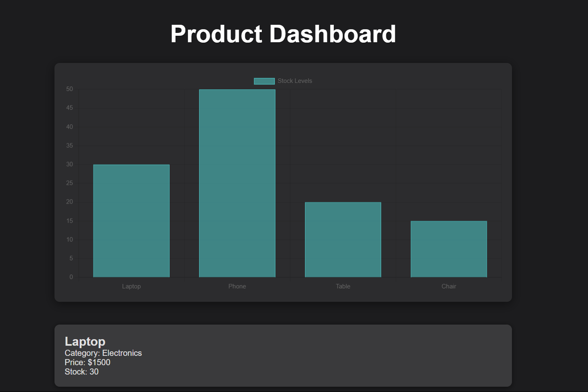
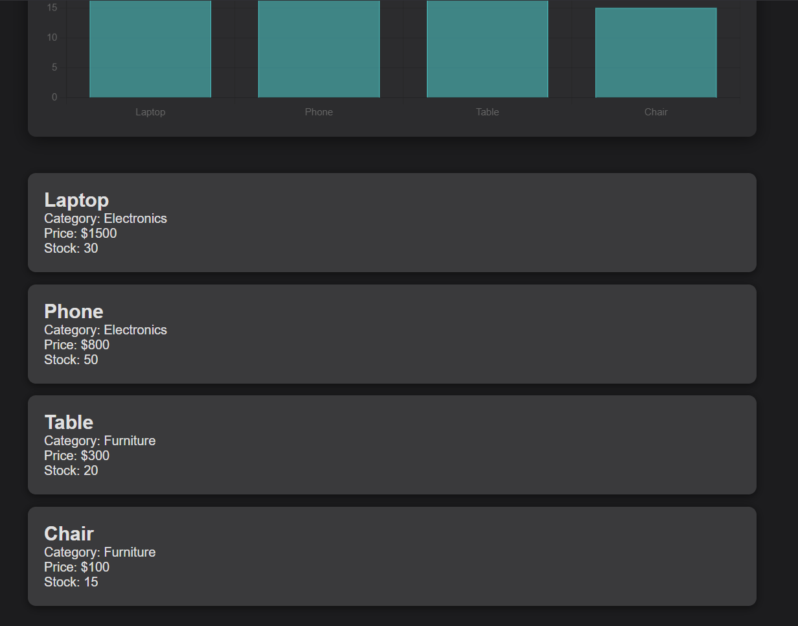

## Demo Product Dashboard using Elasticsearch and React
# Description
This project is a demo application showcasing a product dashboard that utilizes Elasticsearch as the backend database and React for the frontend interface. The application allows users to visualize product data through interactive charts and lists, providing insights into product stock levels and other key metrics.

# Features
Data Ingestion: Insert and manage product data using Elasticsearch.
Dynamic Dashboard: View product statistics through a responsive and visually appealing dashboard.
Interactive Charts: Utilize Chart.js for displaying data in bar charts.
Responsive Design: The application is designed to work seamlessly across various screen sizes.
# Tech Stack
Backend: Elasticsearch
Frontend: React (with Vite)
Styling: Custom CSS for a modern dark theme

## Snapshots

# Getting Started
Clone the repository.
Set up Elasticsearch and insert sample data.
Run the React app using Vite to view the product dashboard.
# Installation
For detailed installation and usage instructions, please refer to the README file.